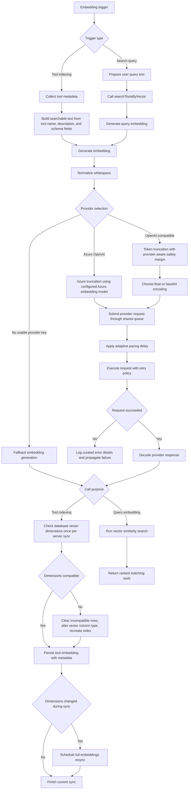
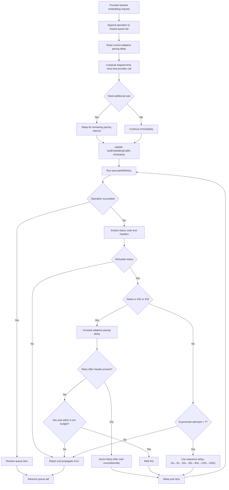
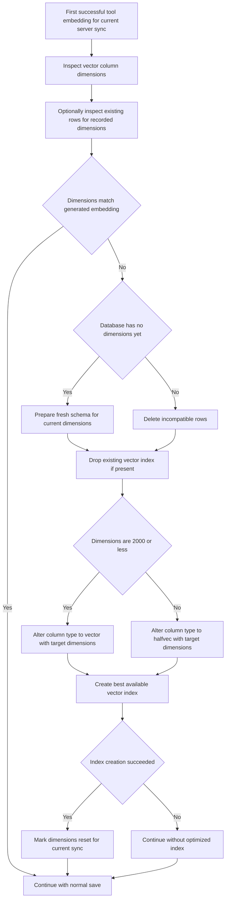

## Overview

This page documents the full embedding lifecycle in MCPHub, from the moment indexing is triggered to the moment vectors are persisted in PostgreSQL. It also covers provider request execution, adaptive pacing, retry behavior, queue-based serialization, and the follow-up resynchronization logic used when vector dimensions change.

The lifecycle applies to two major use cases:

- Tool indexing, where MCPHub creates embeddings for MCP tools and stores them in the vector database.
- Query embedding, where MCPHub creates an embedding for a user search query in order to run semantic similarity search.

The database persistence path exists only for tool indexing. Query embeddings are generated on demand and used immediately for search.

## When Embedding Creation Starts

Embedding creation can begin from several entry points:

1. When an MCP server connects successfully and MCPHub loads its tool list.
2. When an MCP server reconnects and its tools are reloaded.
3. When an OpenAPI-backed server is initialized successfully.
4. When a single tool is re-synced explicitly.
5. When Smart Routing configuration changes and MCPHub triggers a full sync of all connected servers.
6. When a full resync is scheduled because the configured embedding dimensions no longer match the database schema.
7. When Smart Routing handles a user query and needs an embedding for semantic search.

## End-to-End Flow



## Tool Indexing Flow

Tool indexing starts in the server lifecycle layer after tool discovery succeeds. MCPHub builds a searchable text payload per tool by combining:

- Tool name
- Tool description
- Top-level schema property names
- Nested input schema property names

That searchable text becomes the input to the embedding provider or to the fallback embedding generator.

### Important Property

Every tool is processed individually, but provider calls are not executed independently. All embedding provider requests share one queue, which means parallel syncs do not bypass rate limiting.

## Query Embedding Flow

Search queries use the same embedding generator as tool indexing. This is important because:

- Query-time requests use the same provider selection rules.
- Query-time requests use the same queue.
- Query-time requests use the same pacing and retry logic.

This keeps the request pattern consistent whether MCPHub is indexing tools or searching for them.

The main difference is that query embeddings are not written to the database. They are generated, used for similarity search, and then discarded.

## Provider Selection and Request Construction

MCPHub currently supports three main execution paths:

### 1. Azure OpenAI Path

- Validates Azure endpoint, API key, API version, and deployment name.
- Truncates text using the configured underlying Azure embedding model.
- Sends a direct HTTP request with axios.
- Wraps the provider request with the shared queue and retry logic.

### 2. OpenAI-Compatible Path

- Loads Smart Routing provider settings.
- Normalizes whitespace before tokenization.
- Applies token truncation based on the configured embedding model.
- Applies an extra token safety factor for providers such as SiliconFlow, where local and server-side token counts can differ slightly.
- Determines whether to request embeddings in float or base64 format.
- Uses the OpenAI SDK client for the provider call.
- Wraps the provider request with the shared queue and retry logic.

If token truncation fails in this path, MCPHub falls back to heuristic character-based truncation to avoid losing the entire embedding operation.

### 3. Fallback Embedding Path

If a required provider key is missing, MCPHub generates a deterministic low-dimensional fallback vector locally.

This fallback path:

- Does not call any external embedding provider.
- Does not use the shared provider queue.
- Still produces a vector that can be stored in PostgreSQL.
- May trigger a dimension mismatch if the database currently expects a different vector size.

## Shared Queue, Pacing, and Retries

The most important protection mechanism in the embedding pipeline is the shared queue. Every provider-backed embedding request passes through one promise chain. This guarantees that parallel sync jobs cannot send requests concurrently and accidentally bypass pacing rules.

### Queue and Retry Subprocess



### Pacing Rules

The pacing system is adaptive and precisely aligned with provider rate-limit windows (typically 1-minute RPM):

- MCPHub starts with a **0ms base delay** between provider calls by default. No pre-emptive wait is introduced — the system reacts to rate-limit responses rather than guessing in advance.
- When a 403 or 429 error is detected, the pacing delay jumps immediately to **63000ms**.
- That delay remains in effect for subsequent queued provider calls while rate-limit responses continue.
- After **63 seconds** without new rate-limit errors, the delay **immediately resets** to the configured base level.

**Why these specific values?**

- **63s step / 63s maximum**: A single 403/429 is treated as a signal that retrying earlier is not useful, so MCPHub enters full protection immediately.
- **63s cooldown**: This tracks the 1-minute RPM reset window with a small safety margin before returning to normal throughput.
- **Retry-After precedence**: If the provider returns `Retry-After`, MCPHub honors that value instead of applying the local 63-second fallback.

This strategy treats provider throttling as a binary state instead of a gradual one. For example:
- **Normal state**: `0ms` pacing delay
- **After first 403/429**: `63000ms` pacing delay
- **After 63s without new 403/429**: Immediate return to base level (`0ms` by default)

The base delay can be set to a non-zero value in Smart Routing settings for providers that require a fixed minimum interval between requests. The default of 0ms maximizes throughput when the provider cooperates, while the adaptive mechanism handles throttling reactively.

### Retry Strategy

MCPHub uses different retry strategies depending on the error type, reflecting that rate-limit errors and infrastructure errors have fundamentally different characteristics.

**For rate-limit errors (403/429):**
- If the server provides a `Retry-After` header, MCPHub honors it **unconditionally** — no attempt budget or time budget overrides the server's instruction.
- If no `Retry-After` is present, MCPHub applies a 63-second cooldown per retry, bounded by a **5-minute total budget**. This prevents indefinite retries when the provider gives no guidance.

**For infrastructure errors (503/504):**
- MCPHub uses a **fixed exponential sequence** of exactly 7 attempts: 4s, 8s, 16s, 30s, 60s, 120s, 240s.
- No time budget is imposed — all 7 attempts are always made regardless of elapsed time.
- Random jitter is added to each delay to prevent thundering herd effects.

This approach is especially practical for rate-limited providers like SiliconFlow (10 RPM), because:

Important: in MCPHub testing, SiliconFlow has been observed to return HTTP 403 with the message "RPM limit exceeded. Please complete identity verification to lift the restriction." on the 11th request made within one minute or less. This behavior is treated here as an observed runtime characteristic, not as a documented contract, because SiliconFlow's official documentation does not currently document this specific limit or response pattern.

1. The first 403/429 is examined immediately for `Retry-After`.
2. If missing, the system waits 63 seconds (guaranteeing the 60-second hard window has passed).
3. If the next attempt is rate-limited again, MCPHub repeats the same rule: `Retry-After` if present, otherwise another 63-second wait.
4. Without `Retry-After`, the operation fails definitively once the 5-minute budget is exhausted.

### Retry Rules

Retries apply only to specific status codes:

- 403 (Forbidden / Rate Limit)
- 429 (Too Many Requests)
- 503 (Service Unavailable)
- 504 (Gateway Timeout)

For retryable failures, MCPHub uses status-specific retry strategies:

#### 1. Rate Limit Errors (403/429) - Priority to Server Information

When a 403/429 occurs, MCPHub:

1. **On every 403/429 failure**: Checks for `Retry-After` response header.
  - If present, honors the server's wait time **unconditionally** — no time budget applies.
  - If absent, applies a 63-second hardcoded cooldown as the local fallback.
2. Retries the same provider request after the wait.
3. Repeats the same rule for the next 403/429 failure.
4. When `Retry-After` is absent: stops when the next 63s wait would exceed the 5-minute retry budget.

This strategy always respects server-side rate limit policies and protects against indefinite retries when the server gives no guidance.

#### 2. Server Errors (503/504) - Exponential Backoff

For transient server errors:

1. Uses a fixed exponential sequence: 4s, 8s, 16s, 30s, 60s, 120s, 240s — exactly 7 retry attempts.
2. No time budget is imposed. All 7 attempts are always made, regardless of total elapsed time (~8 minutes maximum when the full sequence is exhausted).
3. Does not apply the 63-second rate-limit cooldown.

#### Example Retry Sequence for SiliconFlow (10 RPM, no Retry-After header)

This example reflects the observed SiliconFlow behavior described above, including the undocumented 11th-request-within-a-minute 403 response seen in practice. It should not be read as an official provider guarantee.

```
Attempt 1: 403/429 → No Retry-After found → Wait 63s → Retry
Attempt 2: 403/429 → No Retry-After found → Wait 63s → Retry
Attempt 3: 403/429 → No Retry-After found → Wait 63s → Retry
Attempt 4: 403/429 → No Retry-After found → Wait 63s → Retry
Attempt 5: next 63s wait would exceed 5-minute budget → fail
Total: at most 4 waits of 63s within a 5-minute retry budget
```

When the next 63s wait would push the accumulated retry time past 5 minutes, MCPHub logs the failure with detailed diagnostics and rethrows the error. This provides a hard deadline while giving the operation multiple retry opportunities.

## Error Logging During Embedding Requests

When a provider request fails after retries, MCPHub emits structured diagnostic logs rather than dumping the raw error object. The logged fields include:

- Error name
- Message
- Extracted status
- Provider code when available
- Response status when available
- Nested provider error message when available
- Request ID when present in response headers

This curated logging keeps the logs readable while preserving the most important debugging signals.

## Database Persistence Flow

For tool indexing, each successful embedding is persisted together with:

- Entity type
- Composite tool identifier
- Searchable text
- Embedding vector
- Tool metadata, including server name, tool name, description, and input schema
- Embedding model identifier

The persistence step happens after the embedding vector has been produced. The database write itself is not part of the provider queue.

### Two-Phase Memory-First Sync (Tool Indexing)

To avoid database connection timeouts and improve UI progress reporting, tool indexing now runs as a two-phase process:

- Phase 1 — Generate in memory: MCPHub sequentially generates embeddings for all tools for a given server and model, keeping results in memory. Progress events are emitted during this phase so the UI updates incrementally while long-running provider calls are in progress.
- Phase 2 — Persist to DB: After all embeddings are generated, MCPHub probes the database connection, performs a single dimension compatibility check, and then writes embeddings in a tight loop. Batching writes after generation prevents idle DB connections from staling during long provider waits.

Additionally, a skip-check optimization avoids unnecessary re-generation. Before Phase 1, MCPHub:

- Counts existing embeddings for the exact server prefix and model as a cheap pre-check.
- Only if that count matches the current number of tools, loads the stored tool identities and compares them against the expected content IDs.
- Verifies a deterministic tool-set hash stored in embedding metadata for every retrieved row. The hash is derived from the current tool list (name, description, and input schema) so equal counts alone do not cause a false skip.

Only when both conditions hold does MCPHub skip regeneration:

- Exact content ID set match (same IDs, same cardinality).
- Every retrieved row carries a `toolSetHash` equal to the expected hash for the current tool list.

Progress reporting is also intentionally asymmetric across the two phases:

- Phase 1 emits incremental `in_progress` updates for each generated tool.
- Phase 2 does not emit per-tool persistence progress; it emits a single `completed` event after all embeddings have been saved.
- If either phase fails, MCPHub emits an `error` progress event before propagating the failure so the UI does not remain stuck in an in-progress state.


### Dimension Validation and Schema Management

Before persisting the first tool embedding of a server sync, MCPHub validates that the database vector column can store the generated vector length.



### Index Strategy

MCPHub chooses an index strategy based on vector size:

- Up to 2000 dimensions: standard vector with HNSW, with IVFFlat as a fallback.
- 2001 to 4000 dimensions: halfvec with HNSW when supported by pgvector.
- More than 4000 dimensions: no optimized vector index is created.

If the dimensions change during a server sync, MCPHub schedules a full resynchronization so that all existing tool embeddings are regenerated consistently under the new schema.

When the database has no prior vector dimensions configured, MCPHub treats that as first-time setup. In that case it updates the schema but does not schedule a full resynchronization, because there is no incompatible historical data to regenerate.

## Full Resynchronization Behavior

Full resync is intentionally guarded so that MCPHub does not schedule multiple identical jobs at once.

The scheduler uses two flags:

- One flag to indicate that a resync has already been scheduled.
- One flag to indicate that a resync is currently running.

When the scheduler fires, MCPHub:

1. Enumerates all known servers.
2. Selects only connected servers that currently expose tools.
3. Re-runs tool indexing for each eligible server.

This makes dimension changes safe, even when the previous embeddings were created using a different provider, model, or fallback path.

## Practical Notes

### Why the Queue Exists

Without the shared queue, two parallel sync operations could both wait for the same pacing interval and then send requests at the same time. That would defeat the purpose of adaptive pacing. The queue prevents this by ensuring only one provider-backed embedding request is in flight at a time.

### Why Retries and Pacing Are Separate

Pacing controls the baseline rate of new calls. Retries handle transient failures after a call has already been attempted. MCPHub keeps both mechanisms because provider rate limits and upstream instability are related but not identical problems.

Rate-limit-aware retry strategy is implemented on top of pacing: when a rate limit (403/429) is detected, the retry logic checks for `Retry-After` headers and applies them immediately, or uses a 63-second fallback on that retry. If a later retry is rate-limited again, MCPHub applies the same rule again. This allows retries to respect the exact window timing that the server demands, while pacing ensures that the baseline request rate stays sustainable across all operations.

### Why Different Retry Strategies per Error Type

**Rate-limit errors (403/429 without Retry-After): time-based budget**

A fixed attempt count is unreliable here because the number of retries needed depends on the provider's quota window. A 5-minute budget instead:

- Enforces a hard deadline without requiring a separately tuned maximum count.
- Scales naturally: a provider with a 2-minute window fits ~2 retries; one with a strict 60-second window fits ~4.
- `Retry-After` headers bypass the budget entirely, so the server always has the final word.

**Infrastructure errors (503/504): fixed 7 attempts**

A time budget is inappropriate here because:

- The exponential sequence (4s→8s→16s→30s→60s→120s→240s) already has a well-defined total cost (~8 minutes for all 7 attempts).
- Fixed counts are more predictable than "retry until N minutes" when the wait intervals are already known.
- A time budget could cut the sequence short unpredictably depending on accumulated jitter.

### Why Query Embeddings Use the Same Queue

Search traffic and indexing traffic both consume provider quota. Putting them behind the same queue avoids a situation where search requests starve indexing, or indexing floods the provider while user queries are also running.

### Why Fallback Embeddings Still Matter

Fallback vectors are lower quality than provider-generated embeddings, but they keep Smart Routing operational when provider credentials are missing or unavailable. They also make it possible to keep a consistent database pipeline even when external embedding services are temporarily not in use.

## Summary

The embedding lifecycle in MCPHub is built around four core ideas:

1. Multiple triggers can start indexing or query embedding generation.
2. All provider-backed embedding requests flow through one serialized queue.
3. Adaptive pacing and bounded retries protect the system from provider throttling and transient failures.
4. Database persistence includes dimension validation and index management so that stored vectors remain queryable and structurally consistent.

Together, these mechanisms let MCPHub index tools continuously, search semantically, survive provider limits, and keep the vector store aligned with the active embedding model configuration.